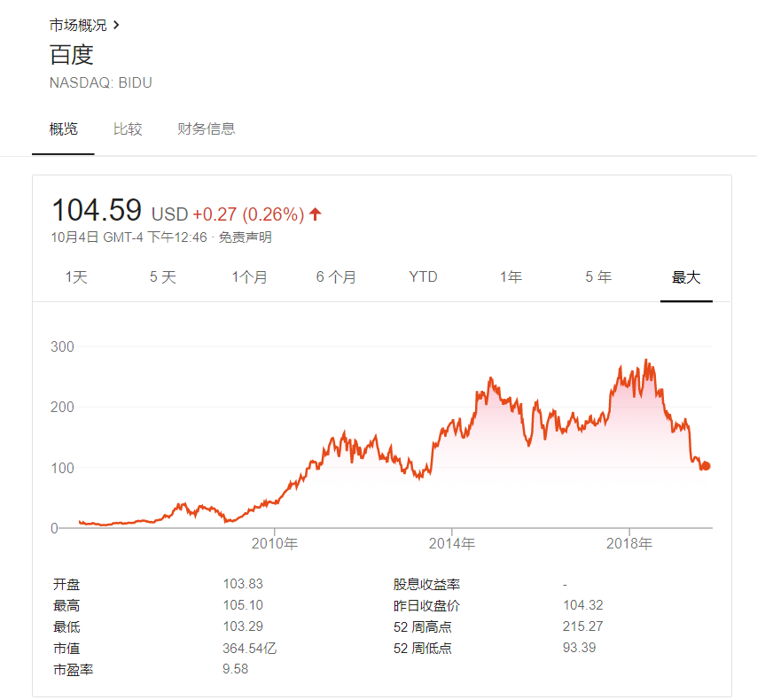

百度的颓势所有人都看出来了。

也许有人的眼光更敏锐，能看到五年前，甚至十年前，百度就将面临今天的状态。十年前是个什么样？我们还在金融危机的阴影下，苹果正在完善三级跳的最后一跳，谷歌、微软、亚马逊都不是市值前五的公司，Facebook和阿里还没有上市 ，今天看来，十年前有两件事在悄然发生：移动互联网和云计算开始兴起。

这里我不会讨论这些大势，毕竟个人的见识有限，我想基于百度体系中我用的一个比较久的产品——百度网盘，进行分析与讨论。

百度的所有产品中，除了国民经常用到的百度搜索引擎以外（近些年搜索引擎在人们心目中也是大打折扣），其他类型的百度产品可以说替代性很强，本篇讨论的百度网盘也是。也许在移动互联网的浪潮中 ，百度自身就没跟上的步伐，百度网盘比较特别的一点就是，在当时众多的竞品中，居然活到了现在。

我们先来看看百度网盘这款产品的定义，用一句话来介绍：一款为用户个人提供云服务的产品，可以将本地的相册、短信、通讯录、通话记录一键备份到云端。很明显：它是一款toC的产品。

放在今天来看，这款toC的产品可替代性已经非常大了。首先，现在主流的智能手机都支持自己平台的备份，已经为用户准备了一备份系统，而且在带宽和流量套餐大幅提升的情况下，用户实在是没有必要再下一款专门备份的软件。其次，备份文件的多样化，各种类型的软件几乎都提供各自的备份机制，QQ等社交类产品提供了图片之类的云备份，影音类产品也提供了平台版权的保障，并且为用户的数据进行处理，用户几乎不需要再将一些音乐、视频下载到本地进行存储，然后再通过网盘上传到云端，这样会显得很麻烦。再者，百度网盘除了提供为用户备份数据和文件的功能外 ，几乎看不到什么亮点，尽管近些年百度网盘自身在功能方面努力在做一些调整，但依然挽救不了这款产品在市场上的颓势。

我似乎把想说的话提前说了，大家看到题目也能猜到百度网盘的前景在这篇文章中是不太乐观的。时至今日，它依然存在于市场，说明它还具有已经的价值，像和它同类的新浪微盘和迅雷快盘已经退出了市场。所以，我们还需要了解它的过去。

2012年的3月，百度推出了百度云，就是百度网盘的前身，按照当时百度给出的官宣说明 ，用户可以将自己的文件放在云盘，并可跨终端查看和分享。而在同时期，国内的金山、115、360、酷盘等先后出来抢占市场。

然而由于互联网的红利期消失，网盘市场同样受到了影响。2016年，新浪微盘、迅雷快盘、华为网盘、UC网盘等相继宣布关闭，停止个人云存储服务，360和腾讯同样进行了业务整改。当然，巨头们依然不会放弃这样的市场，并且，当时的百度看起来似乎没有受到市场波及的震荡。

今天 ，我们使用的百度网盘依旧是那个百度网盘，虽然名字由原先的百度云改成了百度网盘，但功能似乎是一成不变。反观华为和腾讯，他们都是利用自己的生态体系将原先的云盘业务进行了扩张。华为在终端设备为用户提供账号的云备份，用户无需再下载多余的软件，并且操作极为方便。腾讯则利用自己的社交基因和生态 体系，完成了微云业务的扩张，并且由原先单一的云存储备份的基础上扩展了云共享和云编辑。金山自知实力不如前两者雄厚，便专心做起了云文档的业务，对于其他文件则不再过多考虑。而百度，它又做了什么？

百度几乎没有行动，百度网盘虽然近几年在APP的界面上进行了优化，显然，它想为自己注入一定的社交功能 ，并且套用了腾讯QQ的一些做法。另外，APP可以对用户存储的文件进行数据分析，为用户提供千人千面的个性服务。但是这点社交功能实在有些乏善可陈，而且腾讯早已形成自己的生态系统，并且百度并没有将网盘的业务扩展到其他方面，所以这点社交性质可有可无。而后者的个性化服务，实在是没有什么新意可言，用户看了一眼两眼，便会对这些文件有了一个大致的了解，因为存储的文件不会总是大幅度变化，毕竟这不像淘宝打造的场景，后者提供的千人千面服务是因为商品和用户需求都在不断变化，并且基于特定的节假日爆出新花样。纵观百度几个比较主流的产品，搜索引擎，浏览器，百度文库，百度贴吧，百度音乐，百度地图，它们都是各自为战，之间没有太多的联系，并且有的产品因为自身的缘故，反而被市场无情的淘汰。

百度网盘之所以还能活到现在，是因为在移动互联网初期积攒了 一批不错的用户。2013年8月，百度云推出“百度云用户破亿，基础服务震撼升级”活动，宣布提供2TB永久免费容量和无限制离线下载服务，以此吸引了大量的初期用户使用，成为了中国大陆最大的网盘服务商之一。也许就是在那个时候，百度觉得自己正好踏上了移动互联网的快车，一切可以高枕无忧了。殊不知，移动互联网远远没有走到尽头 ，然而百度早已被时代抛在了身后。

到这，百度网盘依然是前景堪忧，即便是母体百度也是不容乐观。如果百度真的倒了，百度网盘要么关闭要么被收购。当然，事情不会严重到这个地步，百度在国内的影响力依旧是有的，并且在今年，百度从上而下进行了一系列 的整改，说明它自己也看到了问题的严重性。百度网盘目前来说还没有太多亮点，但不代表以后没有。第一，百度网盘有很深的根基，它有足够大的用户群保证了产品的市场；第二，百度内部并且在积极改善，All in AI也许就是一个策略，它非常需要足够的时间来证明，如果将来的网盘服务能够加上AI，那么这无疑是网盘中的一大亮点。近些年 ，百度的口碑和市场一样，一直以负面消息居多，打开知乎等平台就能看到，批评之声远大于褒扬之词。而恰恰是在这个时候，百度整体需要冷静下来，并积极做出改善。

参考链接：

[目前互联网上有哪些云盘种类，那个好用？ 2012](https://zhidao.baidu.com/question/473534520.html)

[网盘大批量关停，未来将如何发展？](http://www.woshipm.com/it/333381.html)

[网盘十年，走向何方？](http://www.woshipm.com/it/2909705.html)